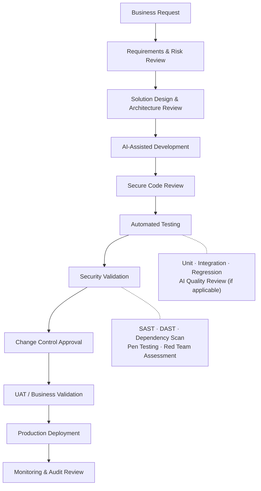

## Summary

The Software Development Lifecycle (SDLC) provides a structured framework for designing, developing, testing, deploying, and maintaining software in a controlled and secure manner. It incorporates governance, security, testing, change management, and audit controls to ensure applications meet business, regulatory, and cybersecurity requirements.

The SDLC also covers AI governance and oversight in development. AI can accelerate software design, coding, testing, and documentation, but **all AI-generated artifacts are subject to the same review, security validation, testing, approval, and audit requirements as traditionally developed software.**

## Objectives

- Continued compliance with regulatory expectations
- Strong auditability and traceability
- Secure coding practices
- Validation and testing
- Controlled deployment processes
- Effective governance of code, including AI-generated code

## Target framework

## Phases


  
  
  
  
  
  
  
  
  
  
  
  
  


See also [AI Governance Controls](ai-governance) and the [Operating Model](operating-model).

## Success metric

> AI generates code, automation performs testing, security validates controls, audit maintains traceability, and **humans retain final accountability for production software.**
